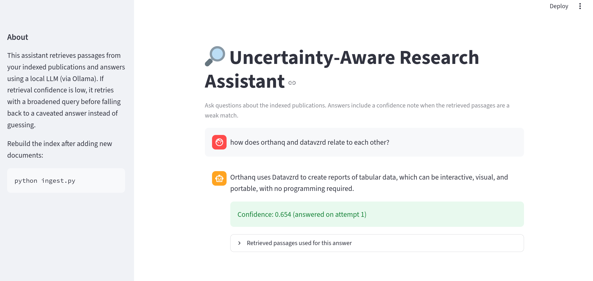

# Uncertainty-Aware Research RAG Assistant

A retrieval-augmented Q&A project over your own publications, wrapped in a
small LangGraph agent that retries with a broadened query when retrieval
confidence is low, and flags the final answer as low-confidence instead of
guessing.




**Stack:** LangChain · LangGraph · Ollama (local LLM + embeddings) ·
ChromaDB · Streamlit · Docker

```
retrieve → assess confidence → confident? ──yes──▶ answer
                 ▲                  │
                 │                  no, attempts left
                 └── broaden query ◀┘
                                     │
                                     no attempts left
                                     ▼
                            answer (with low-confidence caveat)
```

## What's in the repo

- `data/sample_docs/` — placeholder text files (Orthanq, Datavzrd summaries).
  **Replace these with the real abstracts/text from your own publications**
  before running for real.
- `ingest.py` — loads the docs, splits them into chunks, embeds them, and
  stores them in a local Chroma vector database (`chroma_db/`).
- `agent.py` — the LangGraph flow: retrieve → assess confidence → broaden
  query & retry (up to `MAX_ATTEMPTS`) → answer (or answer with a
  low-confidence caveat).
- `app.py` — a Streamlit chat UI on top of `agent.py`, showing the
  confidence level and the retrieved passages for each answer.
- `Dockerfile` + `docker-compose.yml` — package the app together with an
  Ollama service so the whole thing runs with one command.
- `requirements.txt` — pinned package versions known to work together.

## Prerequisites (install once, native run)

1. **Python 3.10+**
2. **Ollama** — https://ollama.com/download
   ```bash
   curl -fsSL https://ollama.com/install.sh | sh   # Linux
   ollama pull nomic-embed-text
   ollama pull llama3.2:1b   # small model — good choice if you're on CPU-only (no dedicated GPU)
   ```

## Setup (native run)

```bash
python3 -m venv venv
source venv/bin/activate        # on Windows: venv\Scripts\activate
pip install -r requirements.txt
```

## Switch from test mode to real models

Both `ingest.py` and `agent.py` have flags at the top of the file:

```python
USE_FAKE_EMBEDDINGS = True   # change to False
USE_FAKE_LLM = True          # (agent.py only) change to False
```

I used `True` in the sandbox because it has no internet access to download
Ollama models. On your own machine, set both to `False` — this switches to
real `OllamaEmbeddings` / `ChatOllama` calls.

## Run it (native)

```bash
# 1. Build the index (run again any time you change the documents)
python ingest.py

# 2. Try the agent from the command line
python agent.py "What is Orthanq and what problem does it solve?"

# 3. Or launch the chat UI
streamlit run app.py
```

The Streamlit sidebar and each answer show the confidence score, whether a
retry happened, and the exact passages used — useful both for debugging
and for demoing the "uncertainty-aware" behavior.

## Run it with Docker (alternative)

```bash
docker compose up -d
docker compose exec ollama ollama pull nomic-embed-text
docker compose exec ollama ollama pull llama3.2:1b
docker compose exec app python ingest.py
```

Then open http://localhost:8501

## Replacing the sample documents with your real publications

`data/sample_docs/` now accepts **both `.txt` and `.pdf` files** — you can
drop your paper PDFs in there directly, no need to convert them to text
first. Delete the two placeholder `.txt` files and add your real files
(e.g. `orthanq_2024.pdf`, `datavzrd_2025.pdf`, `orthanq_2026.pdf`). Then
re-run `python ingest.py`.

A couple of things worth knowing about the PDF loader:
- Each PDF **page** becomes a separate document before chunking, and the
  page number is kept in the metadata — handy later if you want to show
  "this answer came from page 3" in the UI.
- It extracts the underlying text layer of the PDF. If a paper PDF is a
  scanned image (no selectable text), this won't work — that would need
  OCR, which isn't set up here. Your own papers (BMC Bioinformatics, PLoS
  One) should have a proper text layer, so this shouldn't be an issue.

## Notes on the confidence heuristic

`agent.py` uses Chroma's relevance score as a simple proxy for confidence
(see `CONFIDENCE_THRESHOLD` near the top of the file). This is a
reasonable starting point but not a calibrated probability — a natural
next step (and a nice extension to mention if you talk about this project
in an interview) would be to calibrate this against a labeled set of
"good" vs. "bad" retrievals, similar in spirit to uncertainty calibration
work in Bayesian modeling.

